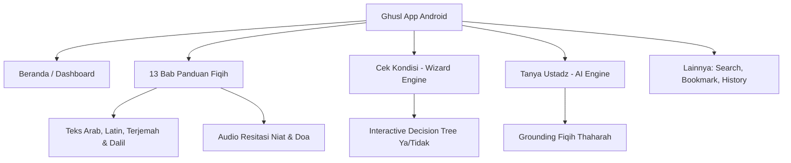

# 🕋 Ghusl Project — Fiqih Mandi Wajib Ecosystem

Selamat datang di repositori sentral **Ghusl Project Organization**. Repositori `.github` ini berfungsi sebagai pusat dokumentasi, standar fiqih thaharah, struktur data konfigurasi jarak jauh (*remote configs*), dan panduan komunitas untuk ekosistem aplikasi **Ghusl: Fiqih Mandi Wajib Lengkap** (`com.niatmandiwajib.ghusl`).

---

## 📱 Tentang Aplikasi

Aplikasi **Ghusl** dirancang khusus untuk memandu setiap muslim dan muslimah dalam melaksanakan ibadah bersuci dari hadats besar secara sah dan benar sesuai sunnah Rasulullah SAW:

* **Nama Resmi Aplikasi**: Ghusl: Fiqih Mandi Wajib Lengkap
* **Nama Internasional (EN)**: Ghusl: Islamic Guide to Ritual Bath
* **Nama Urdu (UR)**: غسل: غسل واجب کی مکمل فقہ (*Ghusl: Ghsal Wajib ki Makmal Faqah*)
* **Package Identifier**: [`com.niatmandiwajib.ghusl`](https://play.google.com/store/apps/details?id=com.niatmandiwajib.ghusl)
* **Distribusi Resmi**: [Google Play Store](https://play.google.com/store/apps/details?id=com.niatmandiwajib.ghusl)

---

## 🎯 Target Pembahasan & Kata Kunci Utama (SEO Indexing)

Proyek ini mendokumentasikan serta menjawab pertanyaan-pertanyaan thaharah yang paling sering dicari umat Islam, antara lain:

| Kategori | Topik Bahasan Fiqih | Kata Kunci Pencarian Populer |
|---|---|---|
| **Niat & Doa** | Niat bersuci dari hadats besar | *niat mandi wajib*, *doa mandi wajib*, *doa niat mandi wajib*, *bacaan mandi wajib*, *doa setelah mandi wajib* |
| **Pria & Junub** | Janabah karena mimpi basah / jima' | *niat mandi wajib pria*, *doa mandi wajib pria*, *cara mandi wajib pria*, *tata cara mandi wajib pria*, *mandi wajib pria keluar mani*, *doa mandi junub*, *tata cara mandi junub* |
| **Wanita (Haid & Nifas)** | Bersuci pasca menstruasi & bersalin | *niat mandi wajib setelah haid*, *doa mandi wajib setelah haid*, *tata cara mandi wajib setelah haid*, *mandi wajib haid*, *niat mandi nifas* |
| **Tata Cara & Rukun** | Langkah bersuci fardhu & sunnah | *tata cara mandi wajib*, *mandi besar*, *rukun mandi wajib*, *sunnah mandi wajib*, *tayamum pengganti mandi wajib* |
| **Global Queries** | Panduan internasional | *ghusl steps*, *how to do ghusl*, *how to perform a ghusl*, *ghusl ki dua*, *ghusl ki niyat*, *ghusl ke faraiz* |

---

## 🏗️ Arsitektur & Fitur Aplikasi

1. **Slide Show Edukatif Dinamis**: 13 modul fiqih mandi wajib yang dimuat secara dinamis via remote JSON untuk memastikan materi selalu terverifikasi oleh para ustadz tanpa harus memperbarui binary aplikasi.
2. **Interactive Decision Tree**: Mesin penentu kondisi hadats besar untuk memberikan kejelasan hukum secara cepat bagi pengguna yang dilanda keraguan.
3. **AI-Powered Consultation (Tanya Ustadz)**: Modul tanya-jawab berbasis Gemini dengan system prompt terspesialisasi fiqih Islam.
4. **Offline & Multi-Language Support**: Dukungan penuh untuk Bahasa Indonesia, Melayu, English, dan Urdu (dengan perlakuan layout Right-to-Left / RTL dan font Naskh/Nastaliq).

---

## 🌐 Tautan Penting & Ekosistem

* 🌐 **Website Resmi**: [https://niat-mandi-wajib.web.id](https://niat-mandi-wajib.web.id)
* 📥 **Unduh di Play Store**: [https://play.google.com/store/apps/details?id=com.niatmandiwajib.ghusl](https://play.google.com/store/apps/details?id=com.niatmandiwajib.ghusl)
* 🔒 **Kebijakan Privasi (Privacy Policy)**: [https://tokiocv.blogspot.com/2026/07/privacy-policy.html](https://tokiocv.blogspot.com/2026/07/privacy-policy.html)
* 👥 **Halaman Komunitas Resmi**: [Facebook Ghusl Community](https://www.facebook.com/profile.php?id=61593997451247)
* 📄 **Profil Organisasi**: [Halaman Profil Organisasi GitHub](https://github.com/profile)

---

## ⚖️ Disclaimer & Etika Fiqih

Konten dalam repositori dan aplikasi ini disusun untuk kepentingan edukasi umum syiar Islam seputar thaharah dan bersuci. Untuk fatwa hukum yang bersifat kasuistik, darurat medis berat, atau persoalan keluarga yang rumit, pengguna dianjurkan tetap berkonsultasi langsung dengan ulama, ustadz, atau lembaga fatwa terpercaya di domisili masing-masing.

---
© 2026 Ghusl Project Organization. All rights reserved.
